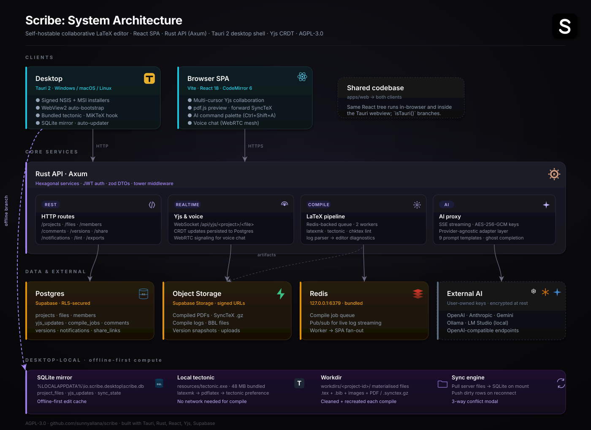

<div align="center">


# Scribe

**The collaborative LaTeX editor you can actually own.**

Real-time multi-author. Offline-first. Self-hostable in a single Rust binary.
Bring your own LaTeX engine, your own AI provider, your own deployment.

[](./LICENSE)
[](#tech-stack)
[](https://codemirror.net)
[](https://docs.yjs.dev)
[](#compile-engines)
[](#install-the-desktop-app)
[](#run-from-source)

[**Install desktop**](#install-the-desktop-app) &nbsp;&middot;&nbsp;
[**Why it exists**](#why-it-exists) &nbsp;&middot;&nbsp;
[**Architecture**](#architecture) &nbsp;&middot;&nbsp;
[**Run from source**](#run-from-source)

</div>

---

## Why it exists

Collaborative LaTeX writing runs into the same persistent problems regardless of which tools a team reaches for, and most workflows leave at least one of them unsolved.

Hosted services like Overleaf and Papeeria are pleasant within their pricing tiers, but the free plans cap how many collaborators a project can have, the paid plans bill per seat, and the document ends up living on infrastructure outside the team's control. Overleaf's Community Edition is open source, which sounds like the answer, except standing it up means running an eight-container Docker stack with MongoDB, Redis, an internal Node service mesh, and a multi-gigabyte TeX Live image: most of a weekend of work before anyone writes a single line. Local editors solve the lock-in by going the other way. TeXstudio, TeXmaker, and VS Code with the LaTeX Workshop extension are fast and entirely offline, but the moment a co-author wants to type into the same document in real time, the workflow regresses to emailed attachments and hand-resolved merge conflicts.

Underneath all of that sits the LaTeX engine itself, which has never really been a single thing to install. TeX Live is gigabytes. MiKTeX downloads packages lazily and quietly fails when one of them cannot be fetched. A collaborator's `pdflatex` drifts a minor version and a `\bibliography{}` macro that resolved cleanly on one laptop yesterday resolves differently on another today. Pandoc, chktex, and Perl each ship their own installer, and getting all of them on the same machine in the right versions is a chore that repeats with every fresh environment.

Scribe addresses each of those problems in a single stack. A single Rust binary runs the API, with no service mesh, no Mongo, and no container choreography. The desktop installer ships its own LaTeX engine inside the bundle, so a clean Windows machine compiles a paper on first launch without a separate MiKTeX setup. The same React codebase powers both the browser SPA and the Tauri shell, with a small `isTauri()` branch on each side handling the local-compile and offline-sync paths. Yjs gives every project the same multi-cursor feel as Google Docs, WebRTC opens a peer-to-peer voice channel between collaborators, and the AI features call out to whichever provider key is configured (OpenAI, Anthropic, Gemini, Ollama, LM Studio, or any OpenAI-compatible endpoint). The whole codebase ships under AGPL-3.0, which keeps a self-hosted instance entirely in the operator's hands.

## How Scribe compares

|                                          |                **Scribe**                 |   Overleaf (cloud)    |    Overleaf Community    |  Papeeria   |     TeXstudio + git      |
| ---------------------------------------- | :---------------------------------------: | :-------------------: | :----------------------: | :---------: | :----------------------: |
| Real-time multi-cursor collaboration     |                    yes                    |       paid tier       |           yes            |     yes     |            no            |
| Self-hostable                            |              one Rust binary              |          no           | 8-container Docker stack |     no      |           n/a            |
| Native desktop installer                 |            MSI + NSIS, signed             |          no           |            no            |     no      | yes (manual TeX install) |
| Offline-first                            |            yes (SQLite mirror)            |          no           |            no            |     no      |           yes            |
| LaTeX engine in the installer            | tectonic bundled, MiKTeX via post-install |          n/a          |           n/a            |     n/a     |     separate install     |
| Voice chat between collaborators         |                WebRTC mesh                |          no           |            no            |     no      |            no            |
| AI assist with your own provider key     |     6 providers, AES-256-GCM at rest      | partial, Premium tier |            no            |     no      |     extensions only      |
| Forward SyncTeX (PDF click jumps editor) |                    yes                    |          yes          |           yes            |   partial   |           yes            |
| Auto-updater on the desktop              |        signed releases via GitHub         |          no           |            no            |     no      |    depends on distro     |
| Source license                           |                 AGPL-3.0                  |      proprietary      |         AGPL-3.0         | proprietary |          varies          |

The check-marks I care about most: a single binary you can `cargo run`, an installer your less-technical collaborator can double-click, and an offline mode that survives a flight to a conference.

## What you get

### Native desktop app

- **Installable Tauri 2 shell** for Windows (NSIS + MSI), macOS (DMG), and Linux (deb / AppImage). The Windows installer ships everything needed to compile on a fresh machine, tectonic bundled as a resource, WebView2 auto-bootstrapped, MiKTeX + Strawberry Perl offered via a `winget` post-install hook.
- **Offline-first compute**: SQLite mirrors the project tree, the bundled tectonic engine compiles locally, materialised workdirs survive restarts, and a sync engine pushes/pulls on reconnect with a three-way conflict modal for hard collisions.
- **Same SPA, two surfaces**: the React codebase runs in-browser AND inside the Tauri webview; `isTauri()` branches the few divergent paths (compile dispatch, deep-link routing, sync engine, Yjs local persistence).
- **Auto-updater** wired against signed GitHub Releases, `Help → Check for Updates` from the native menu.
- **System integration**: native File/Edit/View/Project/Tools/Help menu in Rust, OS-registered `scribe://invite/<token>` deep links, Add/Remove Programs entry with custom uninstaller that asks before removing your local data.

### For writers

- **Real-time multi-author editing** with coloured cursors and live presence avatars,
  backed by a Yjs CRDT, conflict-free even if two people type into the same line at the
  same time.
- **Real-time voice chat** between collaborators via WebRTC peer-to-peer mesh, Opus at
  48 kbps, browser-native echo-cancel / noise-suppression, per-peer mute and master
  speaker mute. Active-speaker indicator pulses the call icon. Server never touches the
  audio bytes; media is DTLS-SRTP between peers.
- **Multi-file editor tabs** above the editor, Ctrl/Cmd+W to close, middle-click close,
  scrollable strip restored from the last session per project.
- **Three-tier roles**: owner / editor / viewer. Viewers can compile and read but never
  write; editors get full access; owners get destructive ops.
- **Live PDF preview** with continuous scroll, virtualised rendering for large docs,
  SyncTeX click-to-source, quick-jump page input, and a switchable paged mode for
  documents over 50 pages. The last rendered PDF + zoom + split position are restored on
  refresh, so reload never costs you a recompile.
- **Bibliography panel** parses every `.bib` file in the project, auto-completes
  `\cite{...}` against keys, and surfaces author/title/year for each entry.
- **Citation search** against CrossRef + arXiv from inside the app, one-click
  "Add to .bib" appends a formatted BibTeX entry to the project's bib file (or creates
  `references.bib` if there isn't one yet).
- **Project-wide find & replace** in a dedicated right-panel tab, case-sensitive, whole-
  word, regex toggles; results grouped per file; "Replace all" rewrites every affected
  file in one operation.
- **Hover preview** for `\ref{...}` / `\eqref{...}` / `\cite{...}`, pops the source of
  the equation / figure / theorem block (with file:line) or the parsed bib entry, without
  navigating away.
- **Suggestion mode** for comments, propose a text replacement for an anchored range;
  reviewers Apply (writes the replacement) or Dismiss. Lighter-weight than full track-
  changes, but covers the "supervisor proposes, author accepts" workflow.
- **Style-lint via chktex** runs on every keystroke pause (800 ms debounced) and on
  compile. Warnings appear in a separate "Style lint" section in the log panel with
  concrete `Fix:` hints; toggle off any time from Settings → Editor.
- **Notification inbox**: bell icon in the nav with unread badge. Mentions, comment
  replies, share-link redemptions show up as persistent notifications you can click into.
- **Shareable project links**: owners issue a read-only or comment-only URL with optional
  expiry that any signed-in user can redeem to join the project, no email needed.
- **Community template gallery**: IEEE conference, ACM article, multi-chapter thesis,
  problem-set, conference poster, plus the six built-in templates. Loaded from a JSON
  manifest in the SPA's public folder.
- **Version snapshots** of the whole project, restorable in one click.
- **AI assist** as inline rewrites, chat, and slash-command rephrasing. The provider is
  chosen per user, the API key is encrypted at rest with AES-256-GCM, and it never leaves the server.
- **Math palette**: **outline panel**: **comments**: **invite-by-email** flow with one-
  click copyable links.
- **Export**: download the rendered PDF, ship the source as a `.zip`, or convert with
  Pandoc to Markdown / DOCX directly from the project menu.
- **Multi-language UI**: English, French, Spanish, German, and Urdu (with RTL support).
  Every string flows through `react-i18next`; adding a language is a translation file
  drop.

### For self-hosters

- **One binary** for the backend (`cargo run -p scribe-server`), no Node runtime, no
  container choreography to get started.
- **One-shot setup scripts**: `./scripts/setup.sh` (Linux apt/dnf/pacman + macOS Homebrew)
  or `.\scripts\setup.ps1` (Windows + winget) install every runtime dep and pre-build the
  workspace. `./scripts/run.sh` / `.\scripts\run.ps1` brings up Redis + API + SPA with
  prefixed log streams.
- **Switchable compile engine with fallback**: `tectonic` (single static binary, auto-
  fetched packages, ~4 s warm) or `latexmk`-style multi-pass against a local TeX Live /
  MiKTeX (~1.5 s warm). Configure `COMPILE_ENGINE=...` and optionally
  `COMPILE_FALLBACK_ENGINE=...`, when the primary returns non-zero, the worker auto-retries
  with the fallback so a project that needs a package not in the tectonic bundle still
  compiles via latexmk.
- **Optional chktex integration**: set `CHKTEX_BIN=/path/to/chktex` and every compile
  - every typing-pause runs a style-lint pass. Warnings come back with concrete `Fix:`
    hints derived from the chktex message text (robust to chktex's per-version rule
    renumbering).
- **Pluggable storage** via the `Storage` trait, currently Supabase Storage; an S3
  adapter is a ~150-line module.
- **Pluggable AI providers** via the same adapter pattern, bring your own endpoint.
- **Response cache** (Moka L1 + Redis L2 + circuit breaker) on the hot read endpoints,
  with cache-disabled mode for dev.
- **OpenTelemetry** + Prometheus exporters baked in; structured `tracing` logs.
- **GitHub Actions out of the box**: `.github/workflows/ci.yml` runs lint, typecheck, tests, and `cargo check` against both Rust workspaces on every push/PR; `.github/workflows/release.yml` fires on a `v*.*.*` tag to download tectonic, write `.env` from secrets, sign the bundle with the configured Tauri key, attach the MSI + NSIS to a draft GitHub Release, and emit a `latest.json` manifest the auto-updater consumes.

## Tech stack

| Layer                  | Technology                                                                                            |
| ---------------------- | ----------------------------------------------------------------------------------------------------- |
| **Frontend**           | React 18, TypeScript (`strict`), Vite, Tailwind, shadcn/ui, Zustand, TanStack Query, react-i18next    |
| **Editor**             | CodeMirror 6 with a custom Lezer-based LaTeX grammar, custom Yjs binding                              |
| **PDF viewer**         | pdf.js with HiDPI oversampling, GPU acceleration, OffscreenCanvas, SyncTeX                            |
| **Realtime**           | Yjs (CRDT) + a Rust WebSocket fan-out (`scribe-yjs`) with per-doc broadcast and read-only enforcement |
| **Backend**            | Rust, Axum 0.7, Tokio 1.40, sqlx 0.8, hyper, tower-http                                               |
| **Auth**               | Supabase Auth (JWT, ES256 / RS256 via JWKS); response cache + circuit breaker                         |
| **Database & storage** | Supabase Postgres + Storage                                                                           |
| **Queue**              | Redis (BLPOP-based job queue, BullMQ-compatible naming)                                               |
| **Compile**            | Tectonic by default; switch to latexmk-style multi-pass against TeX Live / MiKTeX                     |
| **Export**             | Pandoc 3.x (LaTeX → Markdown / DOCX)                                                                  |
| **AI**                 | OpenAI, Anthropic, Gemini, Ollama, LM Studio, any OpenAI-compatible endpoint                          |
| **Build**              | Turborepo + pnpm workspaces; Cargo workspace for the Rust crates                                      |
| **License**            | [AGPL-3.0-or-later](./LICENSE)                                                                        |

## Architecture

<p align="center">
  
</p>

Four layers, in flow order:

- **Clients**: the same React SPA runs in a regular browser AND inside the Tauri desktop shell. `isTauri()` branches the few divergent paths (compile dispatch, sync engine, deep-link routing).
- **Rust API**: Axum on `:3010`, hexagonal services, JWT auth, zod-validated DTOs. Hosts REST routes, a Yjs CRDT WebSocket hub, a Redis-backed compile queue with multi-worker fan-out, and an SSE-streamed AI proxy.
- **Data + External**: Supabase Postgres (RLS-secured) + Object Storage (PDFs, SyncTeX, version snapshots) + Redis (queue, pub/sub for live log streaming), with user-keyed AI providers reached over HTTPS.
- **Desktop-local**: the offline-first branch: SQLite mirror at `%LOCALAPPDATA%\io.scribe.desktop\`, the bundled tectonic binary (no TeX distribution required), per-project workdirs, and a sync engine that pushes/pulls on reconnect with a three-way conflict modal for hard collisions.

## Install the desktop app

The native Tauri build ships everything needed to compile LaTeX on a fresh Windows machine; no separate TeX install needed. Download a release artifact from the [Releases](https://github.com/sunnyallana/scribe/releases) page and run it.

```text
Scribe_<version>_x64-setup.exe    NSIS installer (recommended) · ~20 MB
Scribe_<version>_x64_en-US.msi    Windows Installer (group-policy / IT-friendly) · ~29 MB
```

What the installer takes care of:

- **WebView2 runtime**: auto-bootstrapped by Tauri's NSIS template if missing.
- **Tectonic**: bundled at `<install>\resources\tectonic.exe`. Found first by the Rust shell's `resolve_engine`, so a fresh machine compiles immediately.
- **MiKTeX + Strawberry Perl**: the NSIS post-install hook offers to install both via `winget` so the preferred `latexmk` pipeline (multi-pass `\cite{}` / `\ref{}` resolution) works out of the box. Decline and the bundled tectonic remains as fallback.

What you get after install:

- Start Menu shortcut + Add/Remove Programs entry with a custom uninstaller.
- `PREREQUISITES.md` at `<install>\resources\PREREQUISITES.md` covering OS support, data locations, and troubleshooting.
- Auto-updater wired against signed releases, `Help → Check for Updates` in the app menu.

The uninstaller asks whether to remove your local data (`%LOCALAPPDATA%\io.scribe.desktop\`); pick **No** if you're rolling back or upgrading.

## Run from source

Three ways to bring Scribe up locally, in order of effort:

- [**Fast path**](#fast-path) — one-command scripted setup + run.
- [**Web app — manual**](#web-app--manual) — every step explicit, ideal for understanding what's running.
- [**Desktop app — manual**](#desktop-app--manual) — same Rust server, plus Tauri dev shell.
- [**Self-hosting**](./docs/self-hosting.md) — Docker Compose for a real deployment.

Filling in `.env` is the same in all three paths; see
[**docs/env-vars.md**](./docs/env-vars.md) for where to obtain each value.

### Fast path

```bash
# Linux (Debian/Ubuntu/Fedora/Arch) or macOS
./scripts/setup.sh        # installs Node 22+, pnpm, Rust, Redis, Tectonic, chktex
./scripts/run.sh          # starts Redis + API + SPA with prefixed log streams

# Windows 10/11 (PowerShell, requires winget)
.\scripts\setup.ps1
.\scripts\run.ps1
```

`setup` is idempotent (re-running skips anything already present) and copies
`.env.example` → `.env` on first run; fill in the Supabase keys + `DATABASE_URL`
before `run`. For the desktop shell, `./scripts/run-desktop.{sh,ps1}` brings up the
server + the Tauri dev window in one terminal. See
[`scripts/README.md`](./scripts/README.md) for flags and per-distro notes.

### Web app — manual

The web app is the React SPA running in your browser, hitting the Rust API.

#### Prerequisites

| Need                          | Version      | How to check / install                                                                                               |
| ----------------------------- | ------------ | -------------------------------------------------------------------------------------------------------------------- |
| **Rust**                      | 1.82+        | `rustup default stable`; <https://rustup.rs>                                                                         |
| **Node**                      | 22.13+       | `node --version`; <https://nodejs.org>. pnpm 11 requires Node 22.13 minimum.                                         |
| **pnpm**                      | 11+          | `corepack enable && corepack prepare pnpm@latest --activate`                                                         |
| **Redis**                     | 7+           | `docker run --rm -d -p 6379:6379 redis:7-alpine`, or native install                                                  |
| **Tectonic** (or **latexmk**) | latest       | `cargo install tectonic`, or download from [tectonic-typesetting.github.io](https://tectonic-typesetting.github.io/) |
| **Supabase project**          | free tier ok | <https://supabase.com/dashboard> → New project                                                                       |

Optional: **Pandoc 3+** (Markdown / DOCX export), **chktex** (style linting; ships with TeX Live / MiKTeX), **Docker** (only if you want to run Supabase locally via `pnpm supabase:start`).

#### Steps

```bash
git clone https://github.com/sunnyallana/Scribe.git
cd Scribe
pnpm install

cp .env.example .env
# Fill in the Supabase + DATABASE_URL + AI_KEY_ENCRYPTION_KEY fields.
# Every value's source is documented in docs/env-vars.md.

# Apply DB migrations to your Supabase project:
supabase db push                  # if you linked a hosted project
# — or —
pnpm supabase:start               # if you want a local Supabase stack
```

Two terminals to run the stack:

```bash
# Terminal 1 — start Redis (skip if you already have one running)
docker run --rm -d --name scribe-redis -p 6379:6379 redis:7-alpine

# Terminal 2 — Rust API + compile worker + Yjs hub + voice signaling
cargo run --manifest-path servers/rust/Cargo.toml -p scribe-server
#   → http://localhost:3000

# Terminal 3 — SPA with HMR
pnpm --filter @scribe/web dev
#   → http://localhost:5173
```

Open `http://localhost:5173` and sign up. If you're using a local Supabase stack,
invite emails go to **Inbucket** (`http://localhost:54324`), no SMTP needed.

### Desktop app — manual

The desktop app is the same React SPA, but wrapped in a Tauri 2 window with a Rust
shell that exposes local-compile, SQLite mirror, deep links, and the auto-updater.

#### What the desktop app talks to

The desktop shell is **not** standalone — it still needs the Rust API for any
account-bound feature:

| Feature                                 | Needs the API? |
| --------------------------------------- | -------------- |
| Editing a file locally                  | no             |
| Compiling locally with bundled tectonic | no             |
| Authentication, project list, file sync | **yes**        |
| Real-time collab (Yjs hub)              | **yes**        |
| Comments, share links, voice, AI        | **yes**        |

So in development you run the **same server** as the web flow, plus the Tauri dev
shell on top of it.

#### Additional prerequisites (on top of the web list)

| Need                                | Why                                                                                                                       |
| ----------------------------------- | ------------------------------------------------------------------------------------------------------------------------- |
| Platform-specific Tauri toolchain   | <https://v2.tauri.app/start/prerequisites/> — webview2 (Windows), webkit2gtk (Linux), Xcode (macOS)                       |
| **MSVC Build Tools** (Windows only) | Required by `cargo build` against `*-msvc` targets — install via Visual Studio Installer → "Desktop development with C++" |

Optional but recommended for Windows: **MiKTeX** + **Strawberry Perl** (via
`winget install MiKTeX.MiKTeX StrawberryPerl.StrawberryPerl`), so `latexmk` is
available alongside the bundled tectonic. Otherwise the desktop falls back to
tectonic-only.

#### Steps

```bash
# Same one-time setup as the web app (clone, pnpm install, .env, migrations).

# Terminal 1: Redis
docker run --rm -d --name scribe-redis -p 6379:6379 redis:7-alpine

# Terminal 2: Rust API (mandatory — auth, sync, collab all go through it)
cargo run --manifest-path servers/rust/Cargo.toml -p scribe-server

# Terminal 3: Tauri dev shell. Loads the SPA from Vite's dev server,
# wraps it in a native window, exposes the Rust IPC commands.
pnpm --filter @scribe/desktop tauri dev
```

The first `tauri dev` is slow (~5–10 min) because it compiles all the Rust deps for
the shell — subsequent runs are incremental. A native window appears and the SPA
loads inside it; behave it like the browser flow but with the file system, deep
links, and the bundled compiler available.

#### Producing a release bundle

```bash
pnpm --filter @scribe/desktop tauri build              # signs only if env vars set
pnpm --filter @scribe/desktop tauri build --no-bundle  # binary only, no MSI/NSIS
```

Release bundles land under `apps/desktop/src-tauri/target/release/bundle/`. For
signed releases driven by GitHub Actions, see
[`.github/workflows/release.yml`](./.github/workflows/release.yml).

## Compile engines

Set `COMPILE_ENGINE=tectonic` (default) or `COMPILE_ENGINE=latexmk` and restart the
server. Tradeoffs:

| Engine                         | Cold                                  | Warm   | Setup                              |
| ------------------------------ | ------------------------------------- | ------ | ---------------------------------- |
| **Tectonic**                   | ~15 s (one-time CTAN bundle download) | ~4 s   | Single binary, drops in anywhere   |
| **latexmk-style** (multi-pass) | ~5 s                                  | ~1.5 s | Needs TeX Live or MiKTeX installed |

Both produce the same `.pdf` + `.synctex.gz` + `.log` artifact set; the SPA can't tell
them apart.

### Fallback

Set `COMPILE_FALLBACK_ENGINE=` to the _other_ engine and the worker will auto-retry
when the primary returns non-zero. A common configuration on a workstation that has
both installed:

```
COMPILE_ENGINE=latexmk           # fast warm rebuilds via MiKTeX/TeX Live
COMPILE_FALLBACK_ENGINE=tectonic # safety net when a project misses a local package
```

The compile log reports the engine that produced the result; identical engine on both
fields is ignored (no point running the same compile twice).

## Self-hosting with Docker

```bash
cp .env.example .env
# fill in Supabase + AI_KEY_ENCRYPTION_KEY (see docs/env-vars.md)

docker compose up -d --build
docker compose logs -f app
```

Two containers (the Rust server with tectonic baked in, plus Redis) and a Supabase
project of your choice (hosted free tier or `supabase start`). Full walkthrough +
reverse-proxy / TLS / backup notes in
[**docs/self-hosting.md**](./docs/self-hosting.md).

## Configuration

[`.env.example`](./.env.example) lists every variable inline;
[**docs/env-vars.md**](./docs/env-vars.md) tells you exactly where each value comes
from (Supabase dashboard paths, OpenSSL command for the AI key, etc.). Key knobs:

| Variable                                                           | Effect                                                                                                                  |
| ------------------------------------------------------------------ | ----------------------------------------------------------------------------------------------------------------------- |
| `DATABASE_URL`                                                     | Postgres pooler URL (session pooler, port 5432)                                                                         |
| `SUPABASE_URL` / `SUPABASE_ANON_KEY` / `SUPABASE_SERVICE_ROLE_KEY` | Auth + storage                                                                                                          |
| `SUPABASE_JWT_SECRET`                                              | Used to verify access tokens server-side                                                                                |
| `REDIS_URL`                                                        | Queue + L2 cache; falls back to in-process L1 only when unset                                                           |
| `COMPILE_ENGINE`                                                   | `tectonic` (default) or `latexmk`                                                                                       |
| `COMPILE_FALLBACK_ENGINE`                                          | Engine the worker re-runs with when the primary fails. Set to the other engine for a self-healing pipeline.             |
| `TECTONIC_BIN`, `LATEXMK_BIN`, `LATEX_ENGINE`, `PANDOC_BIN`        | Override binary paths                                                                                                   |
| `TECTONIC_CACHE_DIR`                                               | Override tectonic's CTAN-bundle cache location. Usually unset, its OS default is already populated.                     |
| `CHKTEX_BIN`                                                       | Path to `chktex`. When set, every compile + every typing pause runs a style-lint pass. Unset disables linting entirely. |
| `SCRIBE_ENV`                                                       | `development` / `production` / `testing`, drives feature-flag defaults                                                  |
| `SCRIBE_FEATURE_*`                                                 | Per-feature toggles (`CACHE_ENABLED`, `YJS_REALTIME`, `RATE_LIMITING`, etc.)                                            |
| `AI_KEY_ENCRYPTION_KEY`                                            | Required for `/api/ai/*`, `openssl rand -base64 32`                                                                     |

## Project layout

```
Scribe/
├── apps/
│   └── web/                    Vite + React SPA
├── packages/
│   ├── shared/                 Cross-cutting types, schemas
│   ├── ui/                     Design system (tokens, themes, shadcn primitives)
│   ├── editor/                 CodeMirror 6 LaTeX editor + custom Yjs binding
│   ├── compiler-client/        Log parser + compile types
│   └── yjs-provider/           Yjs client + presence + WS reconnect
├── servers/
│   └── rust/
│       └── crates/
│           ├── scribe-server       Axum API + routes + state
│           ├── scribe-compile      Compile worker (Tectonic / latexmk dispatch)
│           ├── scribe-yjs          Yjs hub + per-doc broadcast
│           ├── scribe-storage      Supabase Storage adapter
│           ├── scribe-auth         JWT verification + JWKS cache
│           ├── scribe-ai           AI provider adapters
│           └── scribe-shared       Cross-crate types
├── supabase/                   Migrations + seed data
├── scripts/
│   ├── setup.{sh,ps1}          Cross-platform one-shot install
│   ├── run.{sh,ps1}            Start Redis + API + SPA together
│   ├── migrations/             One-off DB migration runners
│   ├── probes/                 Read-only DB / auth diagnostics
│   └── utils/                  Misc helpers (local JWT tester)
├── .env.example                All env vars + feature flags
├── PLAN.md                     Full roadmap + principles
└── README.md
```

## Engineering principles

- **Strict TypeScript**: `noUncheckedIndexedAccess`, `exactOptionalPropertyTypes`, zero
  implicit `any`.
- **Hexagonal Rust services**: every service is a struct with a `PgPool` and explicit
  collaborators; HTTP/Axum lives only at the edge.
- **Adapter pattern** for AI providers, storage, compile engines, swap implementations
  via env var, not code changes.
- **Result-shaped errors** in TypeScript; typed `ApiError` enum across the wire.
- **Accessible by default**: WCAG AA, keyboard-first, focus-trapped dialogs, three
  themes (Light, Dark, High Contrast).
- **i18n-first**: every string flows through `react-i18next`; English bundled, more
  languages straightforward to add.

## Roadmap

| Phase | Goal                                                                                                                                                                          | Status |
| ----- | ----------------------------------------------------------------------------------------------------------------------------------------------------------------------------- | ------ |
| 0     | Monorepo foundation                                                                                                                                                           | done   |
| 1     | Auth, projects, files                                                                                                                                                         | done   |
| 2     | LaTeX editor + compile + PDF preview + SyncTeX                                                                                                                                | done   |
| 3     | Realtime collab + presence + version history + comments                                                                                                                       | done   |
| 4     | AI assistance (six providers, encrypted keys)                                                                                                                                 | done   |
| 5     | Bibliography, templates, settings UI, exports                                                                                                                                 | done   |
| 5.5   | Voice chat · multi-file tabs · citation lookup · shareable links · i18n                                                                                                       | done   |
| 5.6   | Find/replace · hover preview · suggestion mode · chktex live-lint · notification inbox · community templates · compile-engine fallback                                        | done   |
| 6     | Tauri desktop app + offline sync                                                                                                                                              | done   |
| 6.5   | Mid-edit overlay · restore-last-compile · offline content cache · forward SyncTeX · file-tree dual-source · auto-updater · `tauri build` smoke                                | done   |
| 6.6   | Branded installer (B&W logo across MSI/NSIS) · bundled tectonic · MiKTeX + Strawberry Perl post-install · uninstall cleanup · prerequisites doc · GitHub Actions CI + Release | done   |
| 7     | Docker self-hosting recipe · env-var sourcing guide · `CONTRIBUTING.md`                                                                                                       | done   |

The only Overleaf-parity item still on the backlog is **GitHub sync** (OAuth + push/pull).
See `PLAN.md` §12 for the full status table.

## License

[AGPL-3.0-or-later](./LICENSE) is the same license family as Overleaf Community Edition. If you run a
modified version as a network service, the modifications must be shared back.

## Author

Built by [**Sunny Shaban Ali**](https://github.com/sunnyallana). Issues, PRs, and
feature requests are welcome.

---

<div align="center">

[Install desktop](#install-the-desktop-app) · [Run from source](#run-from-source) · [Architecture](#architecture) · [Tech stack](#tech-stack) · [Roadmap](#roadmap) · [License](#license)

</div>
