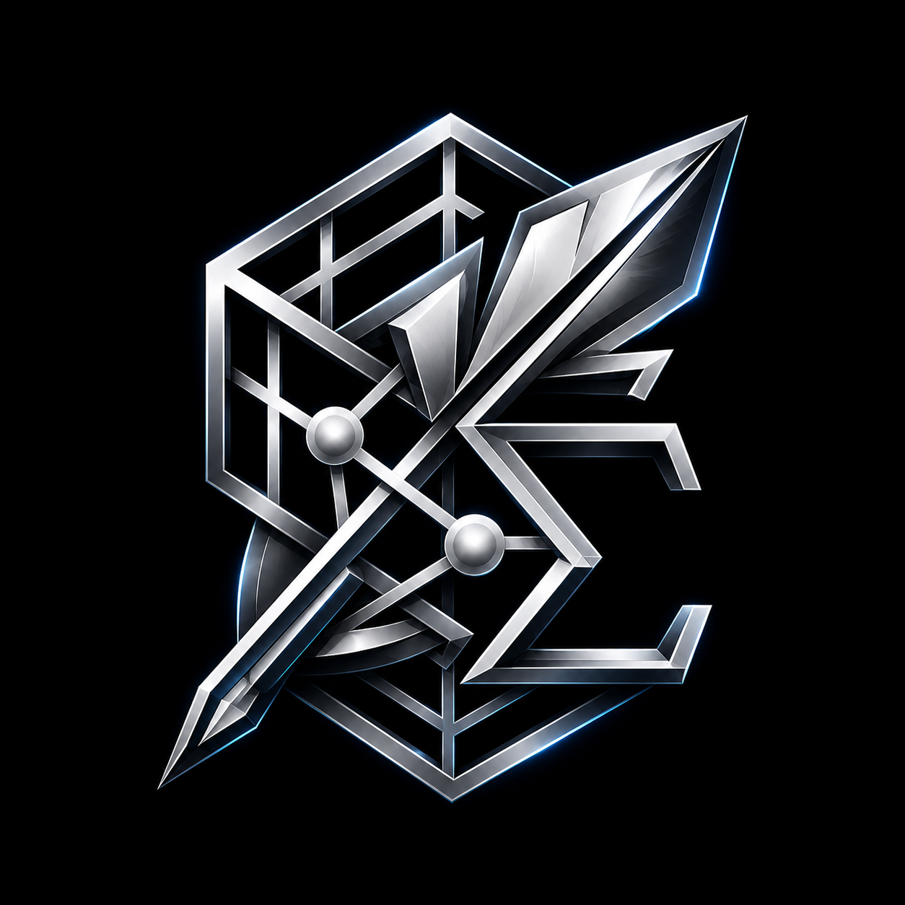

# Scribe

**The collaborative LaTeX editor you can actually own.**

Real-time multi-author. Offline-first. Self-hostable in a single Rust binary.

[**Web app**](./apps/web/README.md) &nbsp;·&nbsp;
[**Desktop app**](./apps/desktop/README.md) &nbsp;·&nbsp;
[**Backend**](./servers/rust/README.md) &nbsp;·&nbsp;
[**Self-host**](./docs/self-hosting.md) &nbsp;·&nbsp;
[**Roadmap**](./PLAN.md)

---

## Why it exists

Collaborative LaTeX writing runs into the same persistent problems regardless of which tools a team reaches for, and most workflows leave at least one of them unsolved.

Hosted services like Overleaf and Papeeria are pleasant within their pricing tiers, but the free plans cap how many collaborators a project can have, the paid plans bill per seat, and the document ends up living on infrastructure outside the team's control. Overleaf's Community Edition is open source, which sounds like the answer, except standing it up means running an eight-container Docker stack with MongoDB, Redis, an internal Node service mesh, and a multi-gigabyte TeX Live image: most of a weekend of work before anyone writes a single line. Local editors solve the lock-in by going the other way. TeXstudio, TeXmaker, and VS Code with the LaTeX Workshop extension are fast and entirely offline, but the moment a co-author wants to type into the same document in real time, the workflow regresses to emailed attachments and hand-resolved merge conflicts.

Underneath all of that sits the LaTeX engine itself, which has never really been a single thing to install. TeX Live is gigabytes. MiKTeX downloads packages lazily and quietly fails when one of them cannot be fetched. A collaborator's `pdflatex` drifts a minor version and a `\bibliography{}` macro that resolved cleanly on one laptop yesterday resolves differently on another today.

Scribe addresses each of those problems in a single stack. A single Rust binary runs the API, with no service mesh, no Mongo, and no container choreography. The desktop installer ships its own LaTeX engine inside the bundle, so a clean Windows machine compiles a paper on first launch without a separate MiKTeX setup. The same React codebase powers both the browser SPA and the Tauri shell, with a small `isTauri()` branch on each side handling the local-compile and offline-sync paths. Yjs gives every project the same multi-cursor feel as Google Docs, WebRTC opens a peer-to-peer voice channel between collaborators, and the AI features call out to whichever provider key is configured (OpenAI, Anthropic, Gemini, Ollama, LM Studio, or any OpenAI-compatible endpoint). The whole codebase ships under AGPL-3.0, which keeps a self-hosted instance entirely in the operator's hands.

## How Scribe compares

|                                          |                **Scribe**                 |   Overleaf (cloud)    |    Overleaf Community    |  Papeeria   |     TeXstudio + git      |
| ---------------------------------------- | :---------------------------------------: | :-------------------: | :----------------------: | :---------: | :----------------------: |
| Real-time multi-cursor collaboration     |                    yes                    |       paid tier       |           yes            |     yes     |            no            |
| Self-hostable                            |              one Rust binary              |          no           | 8-container Docker stack |     no      |           n/a            |
| Native desktop installer                 |            MSI + NSIS, signed             |          no           |            no            |     no      | yes (manual TeX install) |
| Offline-first                            |            yes (SQLite mirror)            |          no           |            no            |     no      |           yes            |
| LaTeX engine in the installer            | tectonic bundled, MiKTeX via post-install |          n/a          |           n/a            |     n/a     |     separate install     |
| Voice chat between collaborators         |                WebRTC mesh                |          no           |            no            |     no      |            no            |
| AI assist with your own provider key     |     6 providers, AES-256-GCM at rest      | partial, Premium tier |            no            |     no      |     extensions only      |
| Forward SyncTeX (PDF click jumps editor) |                    yes                    |          yes          |           yes            |   partial   |           yes            |
| Auto-updater on the desktop              |        signed releases via GitHub         |          no           |            no            |     no      |    depends on distro     |
| Source license                           |                 AGPL-3.0                  |      proprietary      |         AGPL-3.0         | proprietary |          varies          |

## Architecture

  
   
  <i>Clients, Rust API hub, data tier, and the desktop-local offline-first cluster: the four zones that make Scribe work in the browser, on the desktop, and offline from the same codebase.</i>

Four layers, in flow order:

- **Clients**: the same React SPA runs in a regular browser AND inside the Tauri desktop shell. `isTauri()` branches the few divergent paths (compile dispatch, sync engine, deep-link routing).
- **Rust API**: Axum on `:3010`, hexagonal services, JWT auth, zod-validated DTOs. Hosts REST routes, a Yjs CRDT WebSocket hub, a Redis-backed compile queue with multi-worker fan-out, and an SSE-streamed AI proxy.
- **Data + External**: Supabase Postgres (RLS-secured) + Object Storage (PDFs, SyncTeX, version snapshots) + Redis (queue, pub/sub for live log streaming), with user-keyed AI providers reached over HTTPS.
- **Desktop-local**: the offline-first branch. SQLite mirror at `%LOCALAPPDATA%\io.scribe.desktop\`, the bundled tectonic binary (no TeX distribution required), per-project workdirs, and a sync engine that pushes/pulls on reconnect with a three-way conflict modal for hard collisions.

## Components

Per-folder READMEs cover everything specific to each piece. Top-level README stays as a landing page only.

| Where                                            | What                                                                |
| ------------------------------------------------ | ------------------------------------------------------------------- |
| [`apps/web`](./apps/web/README.md)               | React + CodeMirror 6 SPA: the editor itself, runs in any browser    |
| [`apps/desktop`](./apps/desktop/README.md)       | Tauri 2 native shell: offline-first SQLite mirror, bundled tectonic |
| [`servers/rust`](./servers/rust/README.md)       | Axum API hub: REST, Yjs realtime, compile queue, AI proxy           |
| [`scripts`](./scripts/README.md)                 | Cross-platform setup + run scripts (Linux / macOS / Windows)        |
| [`docs/self-hosting.md`](./docs/self-hosting.md) | Docker compose recipe + reverse-proxy / TLS / backup notes          |
| [`docs/env-vars.md`](./docs/env-vars.md)         | Every env var with the exact source for its value                   |
| [`PLAN.md`](./PLAN.md)                           | Phase-by-phase roadmap, status, and design decisions                |
| [`CONTRIBUTING.md`](./CONTRIBUTING.md)           | How to file issues, send patches, and run the test suite            |

## Tech stack

| Layer                  | Technology                                                                                            |
| ---------------------- | ----------------------------------------------------------------------------------------------------- |
| **Frontend**           | React 18, TypeScript (`strict`), Vite, Tailwind, shadcn/ui, Zustand, TanStack Query, react-i18next    |
| **Editor**             | CodeMirror 6 with a custom Lezer-based LaTeX grammar, custom Yjs binding                              |
| **PDF viewer**         | pdf.js with HiDPI oversampling, GPU acceleration, OffscreenCanvas, SyncTeX                            |
| **Realtime**           | Yjs (CRDT) + a Rust WebSocket fan-out (`scribe-yjs`) with per-doc broadcast and read-only enforcement |
| **Backend**            | Rust, Axum 0.7, Tokio 1.40, sqlx 0.8, hyper, tower-http                                               |
| **Auth**               | Supabase Auth (JWT, ES256 / RS256 via JWKS); response cache + circuit breaker                         |
| **Database & storage** | Supabase Postgres + Storage                                                                           |
| **Queue**              | Redis (BLPOP-based job queue, BullMQ-compatible naming)                                               |
| **Compile**            | Tectonic by default; switch to latexmk-style multi-pass against TeX Live / MiKTeX                     |
| **Export**             | Pandoc 3.x (LaTeX → Markdown / DOCX)                                                                  |
| **AI**                 | OpenAI, Anthropic, Gemini, Ollama, LM Studio, any OpenAI-compatible endpoint                          |
| **Build**              | Turborepo + pnpm workspaces; Cargo workspace for the Rust crates                                      |

## License

[AGPL-3.0-or-later](./LICENSE) is the same license family as Overleaf
Community Edition. If you run a modified version as a network service,
the modifications must be shared back.

## Author

Built by [**Sunny Shaban Ali**](https://github.com/sunnyallana). Issues, PRs, and feature requests are welcome.
